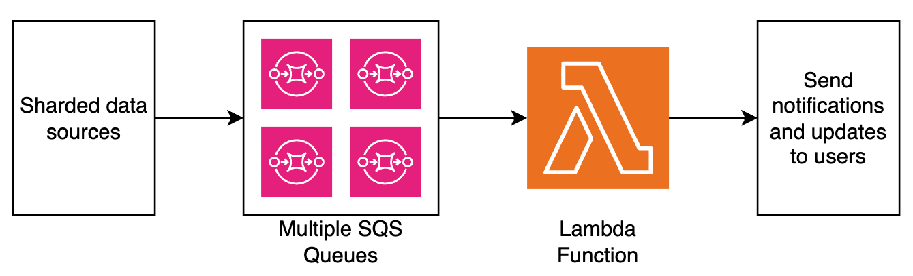
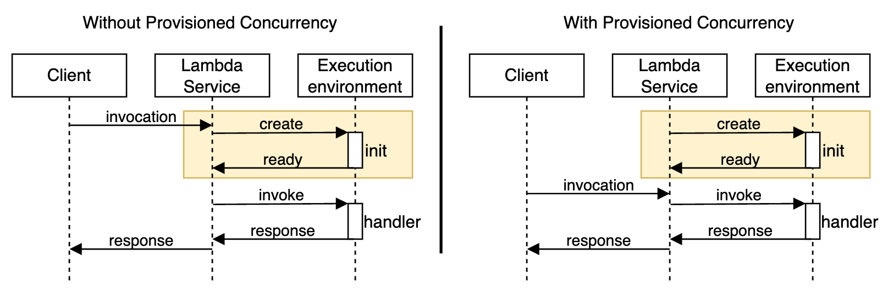
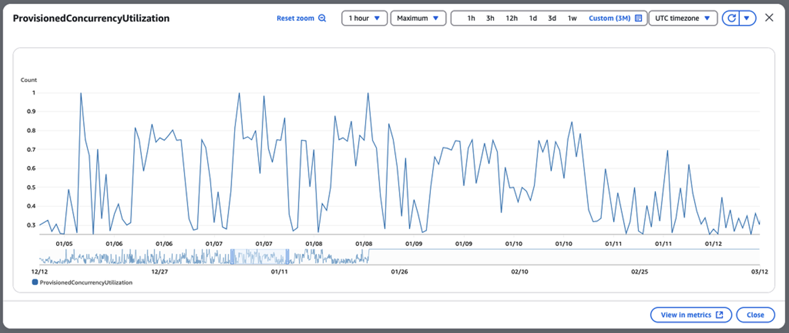
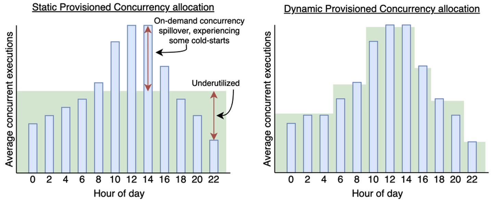
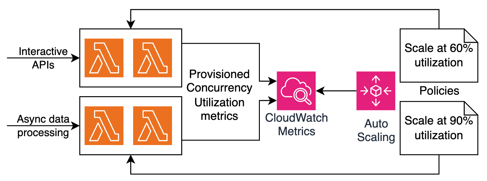
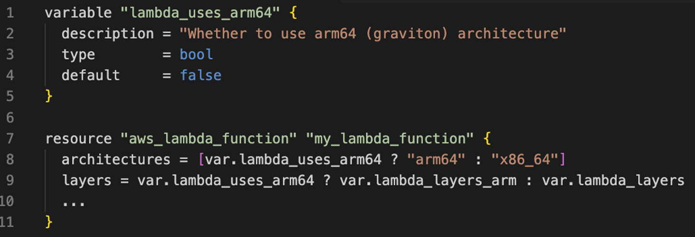

# How Smartsheet Reduced Latency and Optimized Costs in Their Serverless Architecture

> **📖 Original Article**: [How Smartsheet reduced latency and optimized costs in their serverless architecture](https://aws.amazon.com/blogs/architecture/how-smartsheet-reduced-latency-and-optimized-costs-in-their-serverless-architecture/)  
> **👤 Authors**: Anton Aleksandrov, Rony Blum, Donovan Allen, and Ted Bieber  
> **📅 Publication Date**: April 18, 2025  
> **🌐 Source**: AWS Architecture Blog  
> **👨‍💻 Translator**: Quoc Tuan - FCJ Intern  
> **📅 Translation Date**: September 10, 2025  
> **⏱️ Reading Time**: 12-15 minutes

---

## 📋 Summary

This article presents a real-world case study of Smartsheet - a leading enterprise work management platform - on how they optimized their serverless architecture to achieve an **83% reduction in P95 latency** and cost optimization. Through implementing provisioned concurrency with auto scaling and migrating to AWS Graviton, Smartsheet successfully addressed cold start issues in a real-time event processing environment handling tens of thousands of events per second. The article provides detailed insights into event-driven architecture, latency challenges in collaborative platforms, and an optimization blueprint that can be applied by other organizations deploying enterprise-scale serverless architectures.

**🎯 Target Audience**: Solution Architects, DevOps Engineers, Platform Engineers, Engineering Managers  
**📊 Difficulty Level**: Intermediate to Advanced  
**🏷️ Tags**: #AWS #Serverless #Lambda #PerformanceOptimization #CostOptimization #ProvisionedConcurrency #Graviton #CaseStudy #EventDriven

---

## 📚 Table of Contents

- [Introduction](#introduction)
- [Solution Overview](#solution-overview)
- [Optimization Opportunity](#optimization-opportunity)
- [Addressing Cold Start with Provisioned Concurrency](#addressing-cold-start-with-provisioned-concurrency)
- [Auto Scaling Provisioned Concurrency and Graviton Architecture](#auto-scaling-provisioned-concurrency-and-graviton-architecture)
- [Best Practices](#best-practices)
- [Conclusion](#conclusion)
- [About the Authors](#about-the-authors)
- [Glossary](#glossary)
- [References](#references)

---

## Introduction

Cloud software as a service (SaaS) companies are often looking for ways to enhance their architectures for performance and cost-efficiency. Serverless technologies offload infrastructure management, allowing development teams to focus on innovation and delivering business value. As application architectures grow and face more demanding requirements, continued optimization helps maximize both the technical and financial advantages of the serverless approach.

In this post, we discuss Smartsheet's journey optimizing its serverless architecture. We explore the solution, the stringent requirements Smartsheet faced, and how they've achieved an **over 80% latency reduction**. This technical journey offers valuable insights for organizations looking to enhance their serverless architectures with proven enterprise-grade optimization techniques.

## Solution Overview

[Smartsheet](https://www.smartsheet.com/) is a leading cloud-based enterprise work management platform, enabling millions of users worldwide to plan, manage, track, automate, and report on work at scale. At the core of the platform lies an event-driven architecture that processes real-time user activity across various document types. Given the collaborative nature of the platform, multiple users can work on these documents concurrently. Every document interaction triggers a series of events that must be processed with minimal latency to maintain data consistency and provide immediate feedback. Processing delays can impact user experience and productivity, making consistently low latency a fundamental business requirement.

Smartsheet's traffic pattern is spiky during business hours and mostly dormant during nights and weekends. Within peak periods, traffic can fluctuate as users collaborate in real time. To efficiently manage dynamic workloads, which can surge from hundreds to tens of thousands of events per second within minutes, Smartsheet implements a serverless event processing architecture using services such as [Amazon Simple Queue Service](https://aws.amazon.com/pm/sqs/) (Amazon SQS) and [AWS Lambda](https://aws.amazon.com/lambda/). This architecture uses the elasticity of serverless services and the ability to automatically scale dynamically based on the traffic volume. It makes sure Smartsheet can efficiently handle sudden traffic surges while automatically scaling down during off-peak hours, optimizing for both performance and cost-efficiency.

The following diagram illustrates the high-level architecture of the Smartsheet event processing pipeline.

## Optimization Opportunity

Smartsheet uses Lambda functions to serve both batch jobs and API requests. The primary runtime used for building those functions is Java. Lambda [automatically scales](https://docs.aws.amazon.com/lambda/latest/dg/lambda-concurrency.html) the number of execution environments allocated to your function on demand to accommodate traffic volume. When Lambda receives an incoming request, it attempts to serve it with an existing execution environment first. If no execution environments are available, the service initializes a new one. During initialization, the Smartsheet's function code commonly sends several requests to external dependencies, such as databases and REST APIs, which might take time to reply.

The following diagram illustrates how Lambda functions reach out to external dependencies during initialization.

These tasks introduced execution environment initialization latency, commonly referred to as a [cold start](https://docs.aws.amazon.com/lambda/latest/dg/lambda-runtime-environment.html). Although cold starts typically affect less than 1% of requests, Smartsheet had stringent low latency requirements for their architecture to further prioritize the best possible end-user experience.

"To reduce customer request latency while keeping costs low, our engineering team utilized Lambda provisioned concurrency with auto scaling and Graviton, which resulted in an 83% reduction in P95 latency while providing a high quality of service as we continue to scale our platform and its limits," says Abhishek Gurunathan, Sr Director of Engineering at Smartsheet.

## Addressing Cold Start with Provisioned Concurrency

To reduce cold start latency, the Smartsheet team adopted [provisioned concurrency](https://docs.aws.amazon.com/lambda/latest/dg/provisioned-concurrency.html) in their architecture, a capability that allows developers to specify the number of execution environments that Lambda should keep warm to instantly handle invocations. The following diagram illustrates the difference. Without provisioned concurrency, execution environments are created on demand, which means some invocations (typically less than 1%) need to wait for the execution environment to be created and initialization code to be run. With provisioned concurrency, Lambda creates execution environments and runs initialization code preemptively, making sure invocations are served by warm execution environments.

Provisioned concurrency includes a dynamic spillover mechanism, making your serverless architecture highly resilient to traffic spikes. When incoming traffic exceeds the preconfigured provisioned concurrency, additional requests are automatically served by [on-demand concurrency](https://docs.aws.amazon.com/lambda/latest/dg/lambda-concurrency.html) rather than being throttled. This provides seamless scalability and maintains service availability even during traffic surges, while still providing the performance benefits of pre-warmed execution environments for the majority of requests.

The Smartsheet team configured provisioned concurrency to match their historical P95 concurrency needs. This resulted in immediate improvements—the number of cold starts dropped dramatically and P95 invocation latency dropped by 83%. As the team monitored system performance, they quickly identified another architecture optimization opportunity—the Lambda functions were heavily used during work hours but had significantly fewer invocations at night and on weekends, as illustrated in the following graph.

Setting a static provisioned concurrency configuration worked great for busy periods, but was underutilized during off-times. The Smartsheet team wanted to further fine-tune their architecture and increase provisioned concurrency utilization rates to achieve higher cost-efficiency. This led them to look into provisioned concurrency auto scaling to match traffic patterns as well as adopting an [AWS Graviton](https://aws.amazon.com/ec2/graviton/) architecture.

## Auto Scaling Provisioned Concurrency and Graviton Architecture

Two common approaches to enable provisioned concurrency are setting a static value and using auto scaling. With static configuration, you specify a fixed number of pre-initialized execution environments that remain continuously warm to serve invocations. This approach is highly effective for architectures that handle predictable traffic patterns. Unpredictable traffic patterns, however, can lead to under-provisioning during peak periods (with spillover to on-demand concurrency resulting in more cold starts) or underutilization during low-usage periods. To address that, [provisioned concurrency with auto scaling](https://docs.aws.amazon.com/lambda/latest/dg/provisioned-concurrency.html#managing-provisioned-concurency) dynamically adjusts the configuration based on utilization metrics, automatically scaling the number of execution environments up or down to match the actual demand. This dynamic approach optimizes for cost-efficiency and is particularly recommended for architectures with fluctuating traffic patterns.

The following figure compares static and dynamic provisioned concurrency.

To further optimize the architecture for cost-efficiency, the Smartsheet team has implemented provisioned concurrency auto scaling based on utilization metrics. Smartsheet used an infrastructure as code (IaC) approach with Terraform to define auto scaling policies for maximum reusability across hundreds of functions. The policies track the [LambdaProvisionedConcurrencyUtilization](https://docs.aws.amazon.com/lambda/latest/dg/monitoring-metrics-types.html#concurrency-metrics) metric and define the scaling threshold according to the function purpose. For functions implementing interactive APIs, the auto scale threshold is 60% utilization to pre-provision execution environments early, keeping latency extra-low, and making functions more resilient towards traffic surges. For functions that implement asynchronous data processing, Smartsheet's goal was to achieve the highest utilization rate and cost-efficiency, so they've defined the auto scale threshold at 90%.

The following diagram illustrates the architecture of auto scaling policies based on provisioned concurrency utilization rate and workload type.

Another optimization technique Smartsheet employed was switching the CPU architecture used by their Lambda functions from x86_64 to arm64 Graviton. To achieve this, Smartsheet adopted the ARM versions of Lambda layers they've used, such as Datadog and Lambda Insights extensions. This was required because binaries built using one architecture might be incompatible with a different one. Because Smartsheet functions were implemented with Java and packaged as JAR files, they didn't have any compatibility issues when moving to Graviton. With Terraform used for codifying the infrastructure, this architecture switch was a simple property change in `aws_lambda_function` resources, as illustrated in the following code:

By switching to a Graviton architecture, Smartsheet saved 20% on function GB-second costs. See [AWS Lambda pricing](https://aws.amazon.com/lambda/pricing/) for details.

## Best Practices

Use the following techniques and best practices to optimize your serverless architectures, reduce cold starts, and increase cost-efficiency:

- [Fine-tune your Lambda functions](https://serverlessland.com/content/service/lambda/guides/cost-optimization/1-fine-tuning) to find the optimal balance between cost and performance. Increasing memory allocation also adds CPU capacity, which often means faster execution and can lead to reduced overall costs.

- Use a [Graviton2 architecture](https://serverlessland.com/content/service/lambda/guides/cost-optimization/2-graviton) for compatible workloads to benefit from a better price-performance ratio. Depending on the workload type, switching to Graviton can yield [up to 34% improvement](https://aws.amazon.com/blogs/aws/aws-lambda-functions-powered-by-aws-graviton2-processor-run-your-functions-on-arm-and-get-up-to-34-better-price-performance/).

- Use [provisioned concurrency](https://docs.aws.amazon.com/lambda/latest/dg/provisioned-concurrency.html) and [Lambda SnapStart](https://docs.aws.amazon.com/lambda/latest/dg/snapstart.html) to reduce cold starts in your serverless architectures. Start with static provisioned concurrency based on your historical concurrency requirements, monitor utilization, and introduce [auto scaling](https://docs.aws.amazon.com/lambda/latest/dg/provisioned-concurrency.html#managing-provisioned-concurency) into your architecture to achieve the optimal cost-performance profile.

## Conclusion

Serverless architectures using services like Lambda and Amazon SQS offload the infrastructure management and scaling concerns to AWS, allowing teams to focus on innovation and delivering business value. As Smartsheet's journey demonstrates, using provisioned concurrency and Graviton in your architectures can help significantly improve user experience by reducing latencies while also achieving better cost-efficiency, providing a practical blueprint for optimization across the organization. Whether you're running large-scale enterprise applications or building new cloud solutions, these proven techniques can help you unlock similar performance gains and cost-efficiencies in your serverless architectures.

To learn more about serverless architectures, see [Serverless Land](https://serverlessland.com/).

---

## About the Authors

### **Anton Aleksandrov**

Anton is a Principal Solutions Architect for AWS Serverless and Event-Driven architectures. Having over two decades of hands-on engineering and architecture experience, Anton works with major ISV and SaaS customers to design highly scalable, innovative, and secure cloud solutions.

### **Rony Blum**

Rony Blum is a Senior Solutions Architect at AWS based in Seattle, working with ISV customers to design and implement advanced cloud architectures, specializing in SaaS solutions, multi-tenant systems, and Generative AI applications.

### **Donovan Allen**

Donovan Allen is a Senior Software Engineer 1 and Technical Lead for the Sheet Linking Team at SmartSheet. With over 8 years of experience architecting scalable cloud applications, he enjoys digging deep into the details of high-demand, low-latency systems.

### **Ted Bieber**

Ted Bieber is a Software Engineer at Smartsheet. His many years of experience helps him implement practical solutions to complex problems. Ted enjoys working within a cloud environment and learning new technologies.

---

## 📖 Glossary

| English | Definition |
|---------|------------|
| **Serverless Computing** | A cloud computing model that allows running code without managing servers |
| **Cold Start** | The latency incurred when initializing a new function instance from an inactive state |
| **Provisioned Concurrency** | AWS Lambda feature that pre-warms execution environments to reduce cold starts |
| **Event-driven Architecture** | Software architecture pattern that responds to events/triggers from other components |
| **Auto Scaling** | The ability to automatically increase/decrease resources based on demand |
| **P95 Latency** | 95% of requests have response times at or below this value |
| **Spillover Mechanism** | The ability to automatically route excess traffic to on-demand concurrency |
| **Infrastructure as Code (IaC)** | Managing and provisioning infrastructure through code |
| **Graviton** | AWS ARM-based processors that provide better price-performance |
| **Utilization Rate** | The percentage of resources being used compared to total allocated resources |
| **On-demand Concurrency** | Lambda concurrency model that creates execution environments when needed |

## 🔗 References

### Original Documentation
- [Original Article](https://aws.amazon.com/blogs/architecture/how-smartsheet-reduced-latency-and-optimized-costs-in-their-serverless-architecture/): Original article on AWS Architecture Blog
- [AWS Lambda Documentation](https://docs.aws.amazon.com/lambda/): Official AWS Lambda documentation
- [Smartsheet Company](https://www.smartsheet.com/): Official Smartsheet website

### AWS Related Documentation
- [AWS Lambda Pricing](https://aws.amazon.com/lambda/pricing/): AWS Lambda pricing information
- [Provisioned Concurrency](https://docs.aws.amazon.com/lambda/latest/dg/provisioned-concurrency.html): Provisioned Concurrency guide
- [AWS Graviton](https://aws.amazon.com/ec2/graviton/): Information about Graviton processors
- [Lambda SnapStart](https://docs.aws.amazon.com/lambda/latest/dg/snapstart.html): SnapStart feature for Java functions

### Tools and Services
- [Amazon Lambda](https://aws.amazon.com/lambda/): Serverless compute service
- [Amazon SQS](https://aws.amazon.com/sqs/): Simple Queue Service
- [AWS CloudWatch](https://aws.amazon.com/cloudwatch/): Monitoring and observability service
- [Terraform](https://www.terraform.io/): Infrastructure as Code tool
- [Serverless Land](https://serverlessland.com/): AWS serverless resources and patterns

---

## 💬 Translator's Notes

### Translation Challenges

**Technical Terms:**
- "Cold Start" → Maintained technical accuracy while ensuring clarity
- "Provisioned Concurrency" → Preserved AWS-specific terminology
- "Spillover mechanism" → Kept technical precision in translation
- Performance metrics (P95, utilization rate) → Maintained consistency with AWS documentation

**Cultural Context:**
- Smartsheet context → Provided appropriate business context
- Enterprise-grade solutions → Adapted for global enterprise audience
- Cost optimization strategies → Maintained universal applicability

### Technical Insights

**Technical Learning:**
- Deep understanding of serverless optimization at enterprise scale
- Mastery of performance and cost relationships in cloud computing
- Best practices for high-traffic, low-latency systems

**Translation Skills:**
- Developed cloud computing vocabulary
- Improved technical case study translation capabilities
- Learned to maintain technical accuracy while ensuring natural language flow

**Industry Knowledge:**
- Insights into real-world challenges of collaborative platforms
- Understanding patterns and strategies for enterprise serverless adoption
- Knowledge of practical cost optimization techniques

### Recommendations for Global Readers
- Focus on cost optimization aspects as a major concern for enterprises
- Emphasize scalability benefits for rapidly growing companies
- Provide context about enterprise-grade requirements for cloud transition

---

## 🤝 Contributions and Feedback

This translation was completed as part of the **FCJ Internship Program** with the goal of sharing AWS serverless optimization knowledge with the global developer community.

**📧 Contact**: unviantruong26@gmail.com  
**💬 Feedback**: Any suggestions for improving translation quality can be sent to the email above  
**🔄 Updates**: This translation will be updated based on community feedback and AWS changes

**Contributions:**
- Suggestions about terminology
- Corrections about technical accuracy
- Improvements about language fluency
- Additional context for global market

---

*© 2025 - Translation by Quoc Tuan. Please credit when using and sharing.*