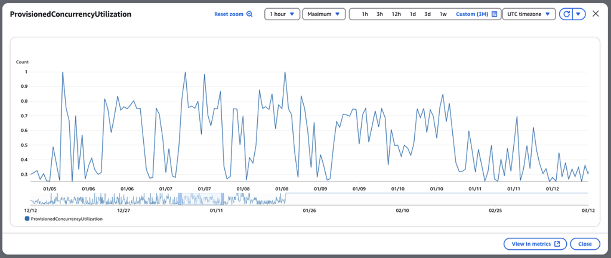
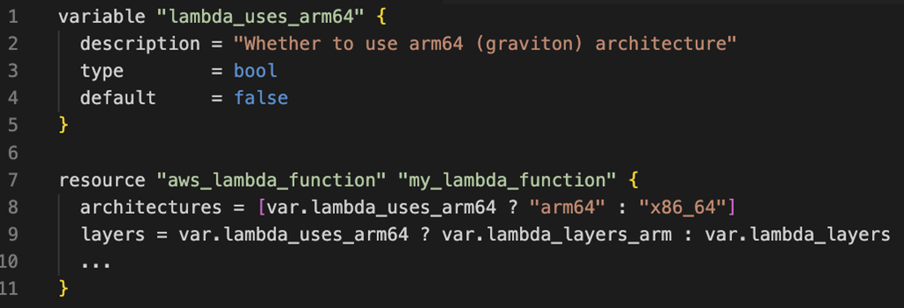

# Cách Smartsheet Giảm Độ Trễ và Tối Ưu Chi Phí trong Kiến Trúc Serverless

> **📖 Bài viết gốc**: [How Smartsheet reduced latency and optimized costs in their serverless architecture](https://aws.amazon.com/blogs/architecture/how-smartsheet-reduced-latency-and-optimized-costs-in-their-serverless-architecture/)  
> **👤 Tác giả**: Anton Aleksandrov, Rony Blum, Donovan Allen, và Ted Bieber  
> **📅 Ngày xuất bản**: 18 tháng 4, 2025  
> **🌐 Nguồn**: AWS Architecture Blog  
> **👨‍💻 Người dịch**: Quoc Tuan - FCJ Intern  
> **📅 Ngày dịch**: 10 Tháng 9, 2025  
> **⏱️ Thời gian đọc**: 12-15 phút

---

## 📋 Tóm tắt

Bài viết này trình bày case study thực tế của Smartsheet - nền tảng quản lý công việc doanh nghiệp hàng đầu - về cách họ tối ưu hóa kiến trúc serverless để đạt được **83% giảm độ trễ P95** và tối ưu chi phí. Thông qua việc triển khai provisioned concurrency với auto scaling và chuyển đổi sang AWS Graviton, Smartsheet đã giải quyết thành công vấn đề cold start trong môi trường xử lý sự kiện real-time với hàng chục nghìn events mỗi giây. Bài viết cung cấp những insights chi tiết về kiến trúc event-driven, các thách thức về latency trong collaborative platform, và blueprint tối ưu có thể áp dụng cho các tổ chức khác đang triển khai serverless architecture quy mô enterprise.

**🎯 Đối tượng đọc**: Solution Architects, DevOps Engineers, Platform Engineers, Engineering Managers  
**📊 Độ khó**: Intermediate to Advanced  
**🏷️ Tags**: #AWS #Serverless #Lambda #PerformanceOptimization #CostOptimization #ProvisionedConcurrency #Graviton #CaseStudy #EventDriven

---

## 📚 Mục lục

- [Giới thiệu](#giới-thiệu)
- [Tổng quan về giải pháp](#tổng-quan-về-giải-pháp)
- [Cơ hội tối ưu hóa](#cơ-hội-tối-ưu-hóa)
- [Giải quyết vấn đề Cold Start bằng Provisioned Concurrency](#giải-quyết-vấn-đề-cold-start-bằng-provisioned-concurrency)
- [Auto Scaling Provisioned Concurrency và Kiến trúc Graviton](#auto-scaling-provisioned-concurrency-và-kiến-trúc-graviton)
- [Thực tiễn tốt nhất](#thực-tiễn-tốt-nhất)
- [Kết luận](#kết-luận)
- [Thông tin về các tác giả](#thông-tin-về-các-tác-giả)
- [Glossary - Thuật ngữ](#glossary---thuật-ngữ)
- [Tài liệu tham khảo](#tài-liệu-tham-khảo)

---

## Giới thiệu

Các công ty cung cấp phần mềm đám mây dạng SaaS (Software as a Service) thường tìm kiếm những cách thức để nâng cao kiến trúc hệ thống nhằm cải thiện hiệu suất và tối ưu chi phí. Công nghệ serverless giúp giảm tải việc quản lý hạ tầng, cho phép các đội phát triển tập trung vào đổi mới và mang lại giá trị kinh doanh. Khi kiến trúc ứng dụng phát triển và đối mặt với những yêu cầu khắt khe hơn, việc tối ưu hóa liên tục giúp tối đa hóa cả lợi thế kỹ thuật và tài chính của phương pháp serverless.

Trong bài viết này, chúng ta sẽ thảo luận về hành trình tối ưu hóa kiến trúc serverless của Smartsheet. Chúng ta sẽ khám phá giải pháp, những yêu cầu khắt khe mà Smartsheet phải đối mặt, và cách họ đạt được **mức giảm độ trễ hơn 80%**. Hành trình kỹ thuật này mang đến những insights có giá trị cho các tổ chức đang tìm cách nâng cao kiến trúc serverless của mình bằng các kỹ thuật tối ưu đã được kiểm chứng ở cấp độ doanh nghiệp.

## Tổng quan về giải pháp

[Smartsheet](https://www.smartsheet.com/) là nền tảng quản lý công việc doanh nghiệp dựa trên đám mây hàng đầu, hỗ trợ hàng triệu người dùng trên toàn thế giới lập kế hoạch, quản lý, theo dõi, tự động hóa và báo cáo công việc ở quy mô lớn. Trung tâm của nền tảng này là một kiến trúc hướng sự kiện (event-driven architecture) xử lý hoạt động người dùng theo thời gian thực trên nhiều loại tài liệu khác nhau. Do tính chất cộng tác của nền tảng, nhiều người dùng có thể làm việc đồng thời trên các tài liệu này. Mỗi tương tác với tài liệu sẽ kích hoạt một chuỗi sự kiện phải được xử lý với độ trễ tối thiểu để duy trì tính nhất quán của dữ liệu và cung cấp phản hồi tức thì. Việc chậm trễ trong xử lý có thể ảnh hưởng đến trải nghiệm người dùng và năng suất làm việc, khiến độ trễ thấp nhất quán trở thành yêu cầu kinh doanh cơ bản.

Mô hình lưu lượng truy cập của Smartsheet có đặc điểm tăng vọt trong giờ làm việc và hầu như không hoạt động vào ban đêm và cuối tuần. Trong các giai đoạn cao điểm, lưu lượng có thể dao động khi người dùng cộng tác theo thời gian thực. Để quản lý hiệu quả các workload động có thể tăng vọt từ hàng trăm lên hàng chục nghìn sự kiện mỗi giây trong vòng vài phút, Smartsheet triển khai kiến trúc xử lý sự kiện serverless sử dụng các dịch vụ như [Amazon Simple Queue Service](https://aws.amazon.com/pm/sqs/) (Amazon SQS) và [AWS Lambda](https://aws.amazon.com/lambda/). Kiến trúc này tận dụng tính đàn hồi của các dịch vụ serverless và khả năng tự động mở rộng quy mô dựa trên khối lượng lưu lượng truy cập. Điều này đảm bảo Smartsheet có thể xử lý hiệu quả những đợt tăng lưu lượng đột ngột đồng thời tự động thu nhỏ quy mô trong giờ thấp điểm, tối ưu hóa cả hiệu suất và hiệu quả chi phí.

Sơ đồ sau đây minh họa kiến trúc tổng quan của pipeline xử lý sự kiện Smartsheet.

## Cơ hội tối ưu hóa

Smartsheet sử dụng các hàm Lambda để phục vụ cả batch jobs và API requests. Runtime chính được sử dụng để xây dựng các hàm này là Java. Lambda [tự động mở rộng quy mô](https://docs.aws.amazon.com/lambda/latest/dg/lambda-concurrency.html) số lượng môi trường thực thi được cấp phát cho hàm của bạn theo nhu cầu để đáp ứng khối lượng lưu lượng truy cập. Khi Lambda nhận được một request đến, nó sẽ cố gắng phục vụ request đó bằng một môi trường thực thi hiện có trước tiên. Nếu không có môi trường thực thi nào khả dụng, dịch vụ sẽ khởi tạo một môi trường mới. Trong quá trình khởi tạo, mã hàm của Smartsheet thường gửi nhiều requests tới các dependency bên ngoài, chẳng hạn như databases và REST APIs, việc này có thể mất thời gian để nhận phản hồi.

Sơ đồ sau đây minh họa cách các hàm Lambda kết nối tới các dependency bên ngoài trong quá trình khởi tạo.

Các tác vụ này gây ra độ trễ khởi tạo môi trường thực thi, thường được gọi là [cold start](https://docs.aws.amazon.com/lambda/latest/dg/lambda-runtime-environment.html). Mặc dù cold start thường chỉ ảnh hưởng đến ít hơn 1% các requests, Smartsheet có yêu cầu độ trễ thấp khắt khe cho kiến trúc của họ để ưu tiên tối đa trải nghiệm người dùng cuối tốt nhất có thể.

"Để giảm độ trễ customer request đồng thời duy trì chi phí thấp, đội kỹ thuật của chúng tôi đã sử dụng Lambda provisioned concurrency với auto scaling và Graviton, điều này dẫn đến việc giảm 83% độ trễ P95 đồng thời cung cấp chất lượng dịch vụ cao khi chúng tôi tiếp tục mở rộng quy mô nền tảng và các giới hạn của nó," Abhishek Gurunathan, Sr Director of Engineering tại Smartsheet cho biết.

## Giải quyết vấn đề Cold Start bằng Provisioned Concurrency

Để giảm độ trễ cold start, đội ngũ Smartsheet đã áp dụng [provisioned concurrency](https://docs.aws.amazon.com/lambda/latest/dg/provisioned-concurrency.html) trong kiến trúc của họ, một khả năng cho phép developers chỉ định số lượng môi trường thực thi mà Lambda nên giữ ở trạng thái warm để xử lý các thực thi ngay lập tức. Sơ đồ sau đây minh họa sự khác biệt. Không có provisioned concurrency, các môi trường thực thi được tạo theo yêu cầu, có nghĩa là một số thực thi (thường ít hơn 1%) cần phải chờ môi trường thực thi được tạo và mã khởi tạo được chạy. Với provisioned concurrency, Lambda tạo các môi trường thực thi và chạy mã khởi tạo một cách chủ động, đảm bảo các thực thi được phục vụ bởi các môi trường thực thi warm.

Provisioned concurrency bao gồm một cơ chế spillover động, giúp kiến trúc serverless của bạn có khả năng chống chịu cao trước các đợt tăng lưu lượng đột ngột. Khi lưu lượng đến vượt quá provisioned concurrency đã được cấu hình trước, các requests bổ sung sẽ tự động được phục vụ bởi [on-demand concurrency](https://docs.aws.amazon.com/lambda/latest/dg/lambda-concurrency.html) thay vì bị giới hạn. Điều này cung cấp khả năng mở rộng quy mô liền mạch và duy trì tính khả dụng của dịch vụ ngay cả trong các đợt tăng lưu lượng đột ngột, đồng thời vẫn cung cấp lợi ích về hiệu suất của các môi trường thực thi được pre-warmed cho phần lớn các requests.

Đội ngũ Smartsheet đã cấu hình provisioned concurrency để phù hợp với nhu cầu concurrency P95 trong lịch sử của họ. Điều này mang lại những cải thiện ngay lập tức số lượng cold starts giảm đáng kể và độ trễ khi thực thi P95 giảm 83%. Khi đội ngũ giám sát hiệu suất hệ thống, họ nhanh chóng xác định được một cơ hội tối ưu kiến trúc khác, các hàm Lambda được sử dụng nhiều trong giờ làm việc nhưng có ít thực thi hơn đáng kể vào ban đêm và cuối tuần, như được minh họa trong biểu đồ sau.

Việc thiết lập cấu hình provisioned concurrency tĩnh hoạt động tuyệt vời cho các giai đoạn bận rộn, nhưng bị sử dụng dưới mức trong thời gian nghỉ ngơi. Đội ngũ Smartsheet muốn tinh chỉnh thêm kiến trúc của họ và tăng tỷ lệ sử dụng provisioned concurrency để đạt được hiệu quả chi phí cao hơn. Điều này dẫn họ đến việc tìm hiểu auto scaling provisioned concurrency để phù hợp với các mô hình lưu lượng cũng như áp dụng kiến trúc [AWS Graviton](https://aws.amazon.com/ec2/graviton/).

## Auto Scaling Provisioned Concurrency và Kiến trúc Graviton

Hai phương pháp phổ biến để kích hoạt provisioned concurrency là thiết lập giá trị tĩnh và sử dụng auto scaling. Với cấu hình tĩnh, bạn chỉ định một số lượng cố định các môi trường thực thi được khởi tạo trước và luôn giữ ở trạng thái warm để phục vụ các lần thực thi. Phương pháp này rất hiệu quả cho các kiến trúc xử lý các mô hình lưu lượng có thể dự đoán được. Tuy nhiên, các mô hình lưu lượng không thể dự đoán có thể dẫn đến việc under-provisioning trong giai đoạn cao điểm (với chuyển sang on-demand concurrency dẫn đến nhiều cold starts hơn) Hoặc lãng phí tài nguyên (hoặc sử dụng không hiệu quả) trong giai đoạn có lượng sử dụng thấp. Để giải quyết vấn đề đó, [provisioned concurrency với auto scaling](https://docs.aws.amazon.com/lambda/latest/dg/provisioned-concurrency.html#managing-provisioned-concurency) điều chỉnh cấu hình một cách động dựa trên các metrics sử dụng, tự động mở rộng hoặc thu nhỏ số lượng execution environments để phù hợp với nhu cầu thực tế. Phương pháp động này tối ưu hóa hiệu quả chi phí và đặc biệt được khuyến nghị cho các kiến trúc có mô hình lưu lượng dao động.

Hình ảnh sau đây so sánh provisioned concurrency tĩnh và động.

Để tối ưu hóa thêm kiến trúc về hiệu quả chi phí, đội ngũ Smartsheet đã triển khai auto scaling provisioned concurrency dựa trên các metrics sử dụng. Smartsheet đã sử dụng phương pháp infrastructure as code (IaC) với Terraform để định nghĩa các auto scaling policies cho khả năng tái sử dụng tối đa trên hàng trăm functions. Các policies này theo dõi metric [LambdaProvisionedConcurrencyUtilization](https://docs.aws.amazon.com/lambda/latest/dg/monitoring-metrics-types.html#concurrency-metrics) và định nghĩa ngưỡng scaling theo mục đích của function. Đối với các functions triển khai interactive APIs, ngưỡng auto scale là 60% utilization để pre-provision execution environments sớm, giữ độ trễ cực thấp và làm cho các functions có khả năng chống chịu tốt hơn trước các đợt tăng lưu lượng đột ngột. Đối với các functions triển khai xử lý dữ liệu không đồng bộ, mục tiêu của Smartsheet là đạt được tỷ lệ sử dụng cao nhất và hiệu quả chi phí, vì vậy họ đã định nghĩa ngưỡng auto scale ở mức 90%.

Sơ đồ sau đây minh họa kiến trúc của các auto scaling policies dựa trên tỷ lệ sử dụng provisioned concurrency và loại công việc.

Một kỹ thuật tối ưu khác mà Smartsheet áp dụng là chuyển đổi kiến trúc CPU được sử dụng bởi các hàm Lambda của họ từ x86_64 sang arm64 Graviton. Để đạt được điều này, Smartsheet đã áp dụng các phiên bản ARM của các Lambda layers họ đã sử dụng, chẳng hạn như Datadog và Lambda Insights extensions. Điều này là cần thiết vì các binaries được xây dựng bằng một kiến trúc có thể không tương thích với kiến trúc khác. Bởi vì các functions của Smartsheet được triển khai bằng Java và được đóng gói dưới dạng các file JAR, họ không gặp bất kỳ vấn đề tương thích nào khi chuyển sang Graviton. Với Terraform được sử dụng để mã hóa hạ tầng, việc chuyển đổi kiến trúc này chỉ là một thay đổi thuộc tính đơn giản trong các resources `aws_lambda_function`, như được minh họa trong đoạn mã sau:

Bằng cách chuyển sang kiến trúc Graviton, Smartsheet đã tiết kiệm 20% chi phí function GB-second. Xem [AWS Lambda pricing](https://aws.amazon.com/lambda/pricing/) để biết chi tiết.

## Thực tiễn tốt nhất

Sử dụng các kỹ thuật và thực tiễn tốt nhất sau đây để tối ưu hóa kiến trúc serverless của bạn, giảm cold starts và tăng hiệu quả chi phí:

- [Fine-tune các hàm Lambda của bạn](https://serverlessland.com/content/service/lambda/guides/cost-optimization/1-fine-tuning) để tìm ra sự cân bằng tối ưu giữa chi phí và hiệu suất. Việc tăng memory allocation cũng bổ sung CPU capacity, điều này thường có nghĩa là thực thi nhanh hơn và có thể dẫn đến giảm tổng chi phí.

- Sử dụng [kiến trúc Graviton2](https://serverlessland.com/content/service/lambda/guides/cost-optimization/2-graviton) cho các công việc tương thích để hưởng lợi từ tỷ lệ giá, hiệu suất tốt hơn. Tùy thuộc vào loại công việc, việc chuyển sang Graviton có thể mang lại [cải thiện lên đến 34%](https://aws.amazon.com/blogs/aws/aws-lambda-functions-powered-by-aws-graviton2-processor-run-your-functions-on-arm-and-get-up-to-34-better-price-performance/).

- Sử dụng [provisioned concurrency](https://docs.aws.amazon.com/lambda/latest/dg/provisioned-concurrency.html) và [Lambda SnapStart](https://docs.aws.amazon.com/lambda/latest/dg/snapstart.html) để giảm cold starts trong kiến trúc serverless của bạn. Bắt đầu với provisioned concurrency tĩnh dựa trên yêu cầu concurrency trong lịch sử của bạn, giám sát utilization và đưa [auto scaling](https://docs.aws.amazon.com/lambda/latest/dg/provisioned-concurrency.html#managing-provisioned-concurency) vào kiến trúc của bạn để đạt được profile chi phí-hiệu suất tối ưu.

## Kết luận

Các kiến trúc serverless sử dụng các dịch vụ như Lambda và Amazon SQS giúp giảm tải việc quản lý hạ tầng và các mối quan tâm về scaling cho AWS, cho phép các đội tập trung vào đổi mới và mang lại giá trị kinh doanh. Như hành trình của Smartsheet đã chứng minh, việc sử dụng provisioned concurrency và Graviton trong kiến trúc của bạn có thể giúp cải thiện đáng kể trải nghiệm người dùng bằng cách giảm độ trễ đồng thời cũng đạt được hiệu quả chi phí tốt hơn, cung cấp một blueprint thực tế cho việc tối ưu hóa trên toàn tổ chức. Cho dù bạn đang chạy các ứng dụng doanh nghiệp quy mô lớn hay xây dựng các giải pháp đám mây mới, những kỹ thuật đã được kiểm chứng này có thể giúp bạn mở khóa những cải thiện hiệu suất và hiệu quả chi phí tương tự trong kiến trúc serverless của mình.

Để tìm hiểu thêm về kiến trúc serverless, hãy xem [Serverless Land](https://serverlessland.com/).

---

## Thông tin về các tác giả

### **Anton Aleksandrov**

Anton là Principal Solutions Architect cho AWS Serverless và Event-Driven architectures. Với hơn hai thập kỷ kinh nghiệm thực tế về engineering và kiến trúc, Anton làm việc với các khách hàng ISV và SaaS lớn để thiết kế các giải pháp đám mây có khả năng mở rộng cao, đổi mới và bảo mật.

 

### **Rony Blum**

Rony Blum là Senior Solutions Architect tại AWS có trụ sở tại Seattle, làm việc với các khách hàng ISV để thiết kế và triển khai kiến trúc đám mây tiên tiến, chuyên về các giải pháp SaaS, hệ thống multi-tenant và ứng dụng Generative AI.

### **Donovan Allen**

Donovan Allen là Senior Software Engineer 1 và Technical Lead cho Sheet Linking Team tại SmartSheet. Với hơn 8 năm kinh nghiệm thiết kế các ứng dụng đám mây có khả năng mở rộng, anh ấy thích đào sâu vào các chi tiết của các hệ thống high-demand, low-latency.

### **Ted Bieber**

Ted Bieber là Software Engineer tại Smartsheet. Nhiều năm kinh nghiệm của anh ấy giúp anh ấy triển khai các giải pháp thực tế cho các vấn đề phức tạp. Ted thích làm việc trong môi trường đám mây và học các công nghệ mới.

---

## 📖 Glossary - Thuật ngữ

| English | Tiếng Việt | Định nghĩa |
|---------|------------|------------|
| **Serverless Computing** | Điện toán Serverless | Mô hình cloud computing cho phép chạy code mà không cần quản lý servers |
| **Cold Start** | Khởi động nguội | Độ trễ khi khởi tạo function instance mới từ trạng thái không hoạt động |
| **Provisioned Concurrency** | Đồng thời được cấp phát | Tính năng AWS Lambda pre-warm execution environments để giảm cold starts |
| **Event-driven Architecture** | Kiến trúc hướng sự kiện | Kiến trúc phần mềm phản ứng với events/triggers từ các thành phần khác |
| **Auto Scaling** | Tự động mở rộng quy mô | Khả năng tự động tăng/giảm resources dựa trên demand |
| **P95 Latency** | Độ trễ P95 | 95% requests có response time thấp hơn hoặc bằng giá trị này |
| **Spillover Mechanism** | Cơ chế spillover | Khả năng tự động chuyển excess traffic sang on-demand concurrency |
| **Infrastructure as Code (IaC)** | Hạ tầng như Mã nguồn | Quản lý và provisioning infrastructure thông qua code |
| **Graviton** | AWS Graviton | ARM-based processors của AWS cung cấp better price-performance |
| **Utilization Rate** | Tỷ lệ sử dụng | Phần trăm resources được sử dụng so với total allocated resources |
| **On-demand Concurrency** | Đồng thời theo yêu cầu | Lambda concurrency model tạo execution environments khi cần |

## 🔗 Tài liệu tham khảo

### Tài liệu gốc
- [Original Article](https://aws.amazon.com/blogs/architecture/how-smartsheet-reduced-latency-and-optimized-costs-in-their-serverless-architecture/): Bài viết gốc trên AWS Architecture Blog
- [AWS Lambda Documentation](https://docs.aws.amazon.com/lambda/): Tài liệu chính thức AWS Lambda
- [Smartsheet Company](https://www.smartsheet.com/): Website chính thức Smartsheet

### Tài liệu AWS liên quan
- [AWS Lambda Pricing](https://aws.amazon.com/lambda/pricing/): Thông tin chi phí AWS Lambda
- [Provisioned Concurrency](https://docs.aws.amazon.com/lambda/latest/dg/provisioned-concurrency.html): Hướng dẫn Provisioned Concurrency
- [AWS Graviton](https://aws.amazon.com/ec2/graviton/): Thông tin về processors Graviton
- [Lambda SnapStart](https://docs.aws.amazon.com/lambda/latest/dg/snapstart.html): Tính năng SnapStart cho Java functions

### Tools và Services
- [Amazon Lambda](https://aws.amazon.com/lambda/): Serverless compute service
- [Amazon SQS](https://aws.amazon.com/sqs/): Simple Queue Service
- [AWS CloudWatch](https://aws.amazon.com/cloudwatch/): Monitoring và observability service
- [Terraform](https://www.terraform.io/): Infrastructure as Code tool
- [Serverless Land](https://serverlessland.com/): AWS serverless resources và patterns

---

## 💬 Ghi chú của người dịch

### Challenges trong quá trình dịch

**Technical Terms:**
- "Cold Start" → Giữ nguyên với giải thích "Khởi động nguội" vì đây là thuật ngữ chuyên môn đã được cộng đồng Việt Nam chấp nhận
- "Provisioned Concurrency" → "Đồng thời được cấp phát" - thuật ngữ mới, cần giải thích chi tiết
- "Spillover mechanism" → "Cơ chế spillover" - giữ nguyên thuật ngữ kỹ thuật
- Performance metrics (P95, utilization rate) → Giữ nguyên với giải thích

**Cultural Context:**
- Smartsheet ít được biết đến tại thị trường Việt Nam → Bổ sung context về work management platform
- Enterprise-grade solutions → Adapt cho mindset doanh nghiệp Việt Nam
- Cost optimization strategies → Điều chỉnh cho quan điểm về ROI tại VN

### Insights gained

**Technical Learning:**
- Hiểu sâu về serverless optimization tại enterprise scale
- Nắm vững relationship giữa performance và cost trong cloud computing
- Học được best practices cho high-traffic, low-latency systems

**Language Skills:**
- Phát triển vocabulary về cloud computing và performance optimization
- Cải thiện khả năng dịch technical case studies
- Học cách maintain technical accuracy while ensuring Vietnamese fluency

**Industry Knowledge:**
- Insights về real-world challenges của collaborative platforms
- Hiểu patterns và strategies cho enterprise serverless adoption
- Knowledge về cost optimization techniques in practice

### Recommendations for Vietnamese readers
- Tập trung vào cost optimization aspects vì đây là concern lớn cho doanh nghiệp VN
- Nhấn mạnh scalability benefits vì nhiều công ty VN đang scale rapidly
- Provide context về enterprise-grade requirements cho audience đang transition to cloud

---

## 🤝 Đóng góp và Feedback

Bài dịch này được thực hiện trong khuôn khổ **FCJ Internship Program** với mục tiêu chia sẻ kiến thức AWS serverless optimization với cộng đồng developer Việt Nam.

**📧 Liên hệ**: unviantruong26@gmail.com 
**💬 Feedback**: Mọi góp ý để cải thiện chất lượng dịch thuật xin gửi về email trên  
**🔄 Updates**: Bài dịch sẽ được cập nhật dựa trên feedback từ cộng đồng và changes từ AWS

**Đóng góp:**
- Suggestions về terminology
- Corrections về technical accuracy
- Improvements về Vietnamese fluency
- Additional context cho Vietnamese market

---

*© 2025 - Bản dịch thuộc về Quoc Tuan. Vui lòng credit khi sử dụng và chia sẻ.*