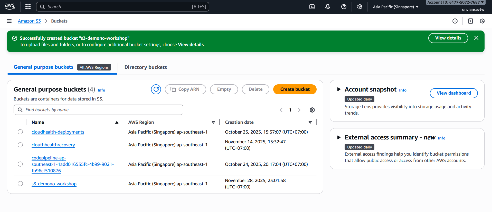

#### Tạo S3 bucket

1. Đi đến S3 management console
2. Trong Bucket console, chọn **Create bucket**

3. Trong Create bucket console
+ Đặt tên bucket: chọn 1 tên mà không bị trùng trong phạm vi toàn cầu (gợi ý: lab\<số-lab\>\<tên-bạn\>)

+ Giữ nguyên giá trị của các fields khác (default)
+ Kéo chuột xuống và chọn **Create bucket**

  

+ Tạo thành công S3 bucket

4. Tạo EC2 trong console 
+ Đi đến EC2 console

+ Click vào lauch instance tại màn hình chính đặt tên cho instance và giữ nguyên các defaults

+ Chọn keypair có sẵn hoặc tạo 1 keypair mới 

+ Trong phần network chọn VPC đã tạo endoint ở phần trước

+ Click vào launch instance và đợi thông báo thành công

5. Tạo IAM role cho EC2 instance và attach role
+ Tìm IAM trên thanh tìm kiếm sau đó nhấn vào IAM role
+ Bấm vào create
+ Chọn vào AWS service và usecase là EC2

+ Bấm next, trong thanh search bar tìm AmazonSSMManagedInstanceCore sau đó chọn và bấm next

+ Đặt tên và bấm create role

+ Di chuyển qua EC2 console, tại đây nhấn vào action và chọn security và chọn modify IAM role

+ Chọn vào IAM role vừa tạo và click vào update IAM role

#### Kết nối với EC2 bằng session manager

1. Trong AWS Management Console, gõ Systems Manager trong ô tìm kiếm và nhấn Enter:

2. Từ **Systems Manager** menu, tìm **Node Management** ở thanh bên trái và chọn **Session Manager**:

3. Click Start Session, và chọn EC2 instance tên **Test-Gateway-Endpoint**. 

Session Manager sẽ mở browser tab mới với shell prompt: sh-4.2 $

Bạn đã bắt đầu phiên kết nối đến EC2 trong VPC Cloud thành công. Trong bước tiếp theo, chúng ta sẽ tạo một  S3 bucket và một tệp trong đó.
#### Create a file and upload to s3 bucket

1. Đổi về ssm-user's thư mục bằng lệnh "cd ~" 

2. Tạo 1 file để kiểm tra bằng lệnh "fallocate -l 1G testfile.xyz", 1 file tên "testfile.xyz" có kích thước 1GB sẽ được tạo.

3. Tải file mình vừa tạo lên S3 với lệnh "aws s3 cp testfile.xyz s3://your-bucket-name". Thay your-bucket-name bằng tên S3 bạn đã tạo.

Bạn đã tải thành công tệp lên bộ chứa S3 của mình. Bây giờ bạn có thể kết thúc session.

#### Kiểm tra object trong S3 bucket

1. Đi đến S3 console.  
2. Click tên s3 bucket của bạn
3. Trong Bucket console, bạn sẽ thấy tệp bạn đã tải lên S3 bucket của mình

#### Tóm tắt

Chúc mừng bạn đã hoàn thành truy cập S3 từ VPC. Trong phần này, bạn đã tạo gateway endpoint cho Amazon S3 và sử dụng AWS CLI để tải file lên. Quá trình tải lên hoạt động vì gateway endpoint cho phép giao tiếp với S3 mà không cần Internet gateway gắn vào "VPC Cloud". Điều này thể hiện chức năng của gateway endpoint như một đường dẫn an toàn đến S3 mà không cần đi qua public Internet.